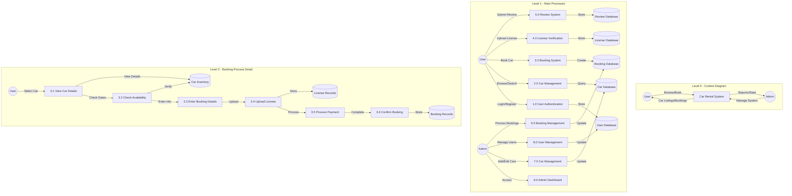

# Car Rental System - Data Flow Diagram (DFD)

## Level 0 - Context Diagram
The context diagram shows the system as a single process and its interactions with external entities (users and admin).

## Level 1 - Main Processes
This level breaks down the system into major processes based on actual implementation:
1. User Authentication (login.php, register.php)
2. Car Management (cars.php, car-details.php)
3. Booking System (book-car.php)
4. License Verification (upload-license.php)
5. Review System (submit-review.php)
6. Admin Dashboard (dashboard.php)
7. Car Management (add-car.php, edit-car.php)
8. User Management (admin/user management)
9. Booking Management (admin/booking management)

## Level 2 - Booking Process Detail
This level provides a detailed view of the booking process as implemented:
1. View Car Details
2. Check Availability
3. Enter Booking Details
4. Upload License
5. Process Payment
6. Confirm Booking

## Data Stores
- User Database: Stores user information and credentials
- Car Database: Maintains car inventory and details
- Booking Database: Records all booking transactions
- License Database: Stores user license information
- Review Database: Stores user reviews and ratings

## Key Features (Based on Actual Implementation)
- User authentication and registration
- Car browsing and detailed view
- Booking management with license verification
- Review submission system
- Admin dashboard with comprehensive controls
- Car management (add/edit/delete)
- User management
- Booking processing
- License verification system

## Security Features
- Secure user authentication
- License verification process
- Admin access control
- Secure payment processing
- Data validation and sanitization 